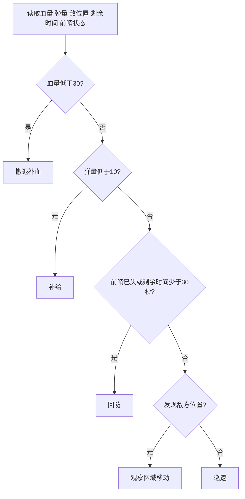

# 演示状态机
每次评估按从上到下的优先级。所有阈值为演示参数。

```mermaid
flowchart TD
  S[读取血量 弹量 敌位置 剩余时间 前哨状态] --> H{血量低于30?}
  H -->|是| R[撤退补血]
  H -->|否| A{弹量低于10?}
  A -->|是| L[补给]
  A -->|否| D{前哨已失或剩余时间少于30秒?}
  D -->|是| F[回防]
  D -->|否| E{发现敌方位置?}
  E -->|是| I[观察区域移动]
  E -->|否| P[巡逻]
```
状态机适于少量状态和明确转移；行为树更便于组合可复用子任务。小型LLM可解释高层意图，但存在延迟、不确定输出和错误状态推断，不能替代确定性边界与碰撞检查。本程序仅离线移动可视化。
